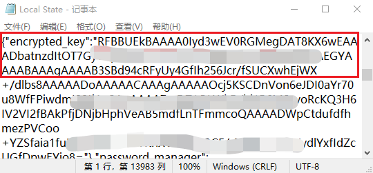

# 密码插件

### Firefox

> Firefox 账户和 Firefox Sync允许您保存并同步您的登陆密码而且会在您使用弱密码时提示您。同时 加密保存您的密码，所以就连 Mozilla 也无法获取它们，与此同时，Firefox 会根据在泄漏事件中泄漏的网站数据库检查您保存的密码是否容易受攻击。

> Firefox 桌面版通过您用户配置文件目录中的 _logins.json_ 文件加密并本地储存您的密码。Firefox 桌面版使用简单的加密技术来保护您的密码。Mozilla 并没有查看您密码的能力，但是 Firefox 桌面版会在本地解密密码，以便可以在网站表单字段中输入密码。

> 为保证安全，使用 主密码保护储存的密码。

[Firefox如何安全地保存密码](https://support.mozilla.org/zh-CN/kb/firefox%E5%A6%82%E4%BD%95%E5%AE%89%E5%85%A8%E5%9C%B0%E4%BF%9D%E5%AD%98%E5%AF%86%E7%A0%81)

### Chrome

而Chrome直接在本地保存加密表单和加密密钥, 未设定主密钥.

### 密码泄露问题

#### 云端泄露

现代浏览器基本都带有同步功能,能够在登陆后迅速同步浏览器的所有配置,其中也包括所有保存的密码,  因此密码表单一定会保存到服务器数据库中.

该位置发生信息泄露的风险比较小.

##### 安全检查

#### 本地泄露

浏览器一般会将密码表单加密后保存在本地, 加密密钥同样保存在本地.

发生信息泄露的风险很大.

##### 实际泄露测试

- 修改HTML文件
  进入用户名密码被保存的网站中,浏览器会自动填充用户名和密码,其中密码显示为"*".
  
  

  现在我们尝试修改HTML文件, 将`type=password`修改为`type=text`,会发现密码明文显示在屏幕上.

- 直接获取本地保存密文及密钥
  chrome使用AES加密密码表单, 但其密文和密钥都存放在本地,以Edge为例:
  
  - 密文路径: `C:\Users\25137\AppData\Local\Microsoft\Edge\User Data\Default\Login Data`
  
  - 密钥路径: `C:\Users\25137\AppData\Local\Microsoft\Edge\User Data\Local State`
  
  打开`Local State`文件即可找到加密密钥:
  
  
  
  
  

### 总结

安全性和便利性难以兼顾.

